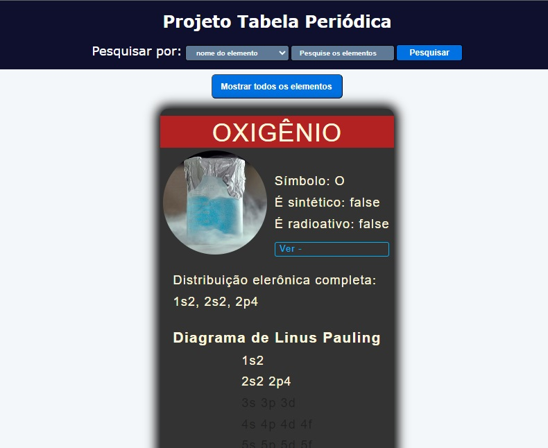

# Tabela periódica
Feita em Javascript Vanila.

Exibe os elementos dos antigos grupos "A" da tabela periódica, separados por grupos. Permite a busca de elementos.

Live preview: 
[Clique aqui para acessar](https://lcarrati.github.io/tabela-periodica/) 

&nbsp;
## Tecnologias utilizadas

> Javascript Vanilla
- Objetos
- Manipulação do DOM
- Funções
- Eventos
- Arrays
- Condicionais if/else

> CSS
- Flexbox
- Grid
- Transições
- Efeitos

> Ferramentas
- Visual Studio Code
- Git & Github

&nbsp;
## Resultado
- **Elementos semanticos** do HTML5 foram utilizados para estruturar a página.
- **Flexbox** e **Grid** do CSS3 foram utilizados para criar o layout.
- **Git e GitHub** foi utilizado para versionamento e publicação.
- Código refatorado para tentar atingir **clean code**. 

&nbsp;
## Dá uma conferida ! 
[Clique aqui para acessar](https://lcarrati.github.io/tabela-periodica/) 

&nbsp;

